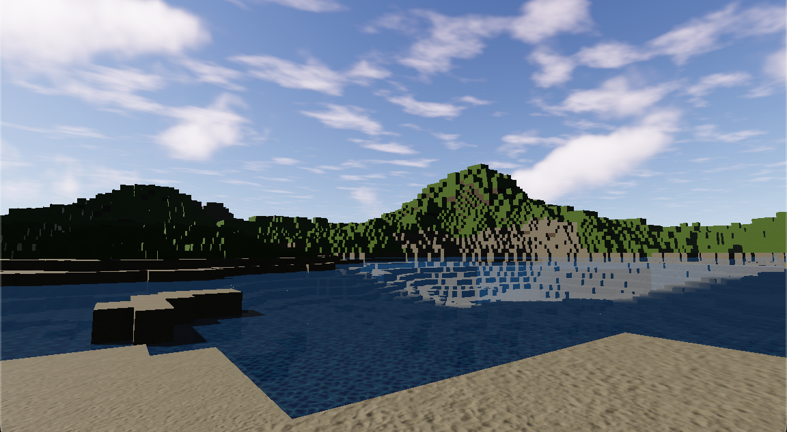

# Chunkee

Chunkee is a voxel engine written in Rust, designed to be integrated with the Godot game engine.

## Demo



## How to Use

1.  **Build the GDExtension**

    ```bash
    cargo build -p chunkee-godot
    ```

    This will compile the Rust code into a dynamic library that Godot can use.

2.  **Run the Godot Project**

    ```bash
    cd ..
    godot ./godot/project.godot
    ```

    _Note: This requires the `godot` command to be available in your system's PATH._

## Project Structure

The project is structured as a Cargo workspace and is made up of two main components:

- `chunkee-core`: The heart of the engine, responsible for core functionalities like world generation, chunk management, and meshing.
- `chunkee-godot`: A GDExtension that bridges the `chunkee-core` library with Godot, allowing you to use the engine's features within a Godot project.

## Improvements

- Project:
- Move example Godot project out of chunkee-godot and into separate folder
- make chunkee-godot agnostic

- Storage:

  - Run Length Encoding (RLE) w/ uniform flag: Would allow skipping generation of uniform chunks (all air, all water, all stone).
  - Allow storing of all procedurally generated content?

- Meshing:
- Seams when a chunk LOD changes and its neighbors haven't been updated yet (jarring)

- Generation:
  - Come up with system for placing entities across chunk boundaries (trees, buildings etc..)
